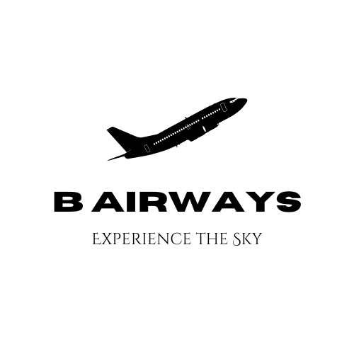
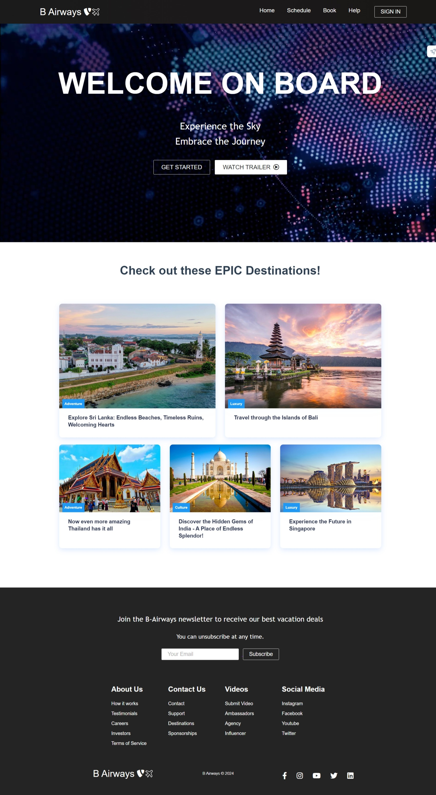

# Airline Reservation System  

B Airways is a subsidiary of Virgin Airlines but functions independently. It currently caters only 
to the needs of small distance, internal flights in Indonesia. Hence, they do not possess access 
to the advance airline reservation system of Virgin. With the recent gain of popularity, the 
director board of B Airways has decided to expand the airline to cover multiple destinations 
worldwide. For this process, B purchased several, refurbished aircrafts to be used in the newer 
routes. Among those are 3 of Boeing 737, 4 of 757, and single Airbus A380. Each model has 
a varying seating capacity that is consistent among the model. As the first stage of expansion, 
B would fly on routes covering CGK and DPS (Indonesia), BIA and HRI (Sri Lanka), DEL, 
BOM, MAA (India), BKK and DMK (Thailand), SIN (Singapore). Multiple flights will be created 
covering these destinations. 

In B systems, a flight has a designated origin and a destination. For an example BIA → BKK 
is considered as one flight. It is also referred to as a route, yet currently B does not offer transit 
/ transfer flights. Hence only two locations are related to a given flight, B would pre-define a 
flight schedule for each flight every day. Each scheduled flight would have the corresponding 
flight details and an assigned airplane. Two airplanes cannot be assigned to the same flight 
schedule at the same time. Flight schedule is static in general. Only exception being the flight 
delays, in which the schedule is updated to reflect the delay. When a passenger need to book 
a flight, he or she should first login to their online platform. Passenger could either continue as 
a guest of register with the platform. Registered users are categorized as Frequent and Gold 
depending on the number of times they have booked with B. They would get 5% and 9% 
discounts off the final ticket prices respectively. The platform will first show the user with the 
flight schedule for each day, where the user could select a flight. Once selected, user is 
prompted with a seat selection. No two users can select the same seat and B does not 
overbook the seats as other airlines. Once a seat is selected, a booking is created. The 
booking is considered completed after payments. Payments will not be handled by the system. 
A ticket is allocated when the booking is completed. The prices may vary depending on the 
traveler class (Economy, Business or Platinum).  

## Features

- Light/dark mode toggle
- Live previews
- Fullscreen mode

## Screenshots

## Appendix

Any additional information goes here

## Feedback

If you have any feedback, please reach out to us at bawantha.22@cse.mrt.ac.lk

## Authors

## License

[MIT](https://choosealicense.com/licenses/mit/)
